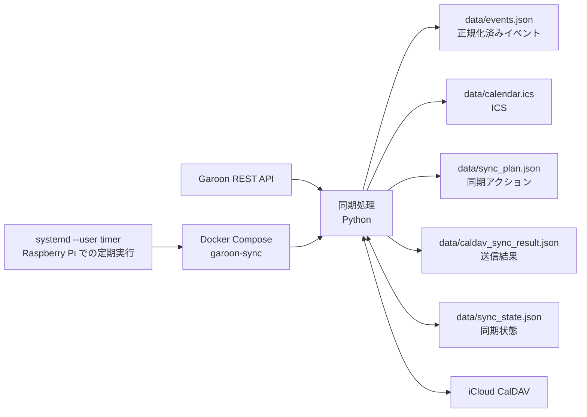

# garoon-icloud-sync

## 概要

`garoon-icloud-sync` は、Garoon の予定を取得し、iCloud CalDAV カレンダーへ同期するためのツールです。実行は Docker Compose を前提としており、Raspberry Pi 上では `systemd --user` timer を使って定期実行できます。

このツールは、初回の広範囲同期と、その後の通常運用を分けて扱う前提で設計しています。

- 初回は `dry-run` で差分を確認してから本番反映する
- 初回の backfill は広い取得範囲で一度だけ実施する
- 通常運用は `GAROON_START_DAYS_OFFSET=0`、`GAROON_END_DAYS_OFFSET=92` を推奨する
- 削除判定は fetch window ベースの安全側ロジックで行う

README は導入と運用の入口に絞り、Raspberry Pi での詳細な常時運用手順は [docs/raspberry-pi-operation.md](docs/raspberry-pi-operation.md) にまとめています。

## 主な機能

- Garoon REST API から指定期間の予定を取得
- 取得した予定を内部で正規化し、JSON と ICS を生成
- iCloud を含む CalDAV サーバーに対して `create` / `update` / `delete` を判定して同期
- `sync_state.json` を使った状態管理付きの差分同期
- fetch window ベースの削除判定により、通常運用で範囲外イベントを誤削除しにくい
- `CALDAV_DRY_RUN=true` による安全な事前確認
- `sync_plan.json` と `caldav_sync_result.json` による差分・送信結果の可視化
- Raspberry Pi + Docker Compose + `systemd --user` timer による継続運用
- start-only timed event では iCloud 対応のため `DTEND` を補完

## システム構成



Garoon から取得した予定はコンテナ内の Python アプリで正規化され、JSON と ICS を生成したうえで CalDAV に同期されます。`sync_state.json` は差分判定の基準状態、`sync_plan.json` は今回の同期予定、`caldav_sync_result.json` は実行結果の記録です。Raspberry Pi 運用では、この処理を `systemd --user` timer から定期実行します。

## 同期の流れ

1. Garoon から、`GAROON_START_DAYS_OFFSET` から `GAROON_END_DAYS_OFFSET` までの予定を取得します。
2. 取得した予定を内部モデルへ正規化し、`data/events.json` と `data/calendar.ics` を生成します。
3. `sync_state.json` と比較して、CalDAV に対する `create` / `update` / `delete` / `skip` を判定し、`data/sync_plan.json` を保存します。
4. CalDAV に同期を実行し、結果を `data/caldav_sync_result.json` に保存します。
5. `dry-run` でなければ、成功した結果をもとに `sync_state.json` を更新します。

削除判定は「そのイベントを最後に確認した取得範囲が、今回の取得範囲に完全に含まれるか」で判断します。そのため、初回 backfill で広く取り込んだイベントは、通常運用の狭い window に切り替えたあとでも、範囲外という理由だけで削除されにくい設計です。

また、start-only timed event は iCloud 互換性のため `DTEND` を補完して ICS を生成します。

## クイックスタート

最初は本番カレンダーではなく、テスト用カレンダーで `dry-run` から始めてください。
初回は `CALDAV_CALENDAR_NAME` に本番カレンダーを指定せず、必ずテスト用カレンダー名を設定してください。

### 1. リポジトリを取得する

```bash
git clone <YOUR_REPOSITORY_URL>
cd garoon-icloud-sync
cp .env.example .env
mkdir -p data/diagnostics data/reports data/backups
```

### 2. `.env` を設定する

最低限、次の項目を設定します。

```dotenv
GAROON_BASE_URL=https://example.cybozu.com/g
GAROON_USERNAME=your-username
GAROON_PASSWORD=your-password

CALDAV_URL=https://caldav.icloud.com
CALDAV_USERNAME=your-apple-id-or-app-specific-user
CALDAV_PASSWORD=your-app-specific-password
CALDAV_CALENDAR_NAME=Garoon Sync Test

GAROON_START_DAYS_OFFSET=0
GAROON_END_DAYS_OFFSET=92
CALDAV_DRY_RUN=true
```

`CALDAV_URL` は実装上の環境変数名です。iCloud を使う場合も `ICLOUD_CALDAV_URL` などの別名は使わず、必ず `CALDAV_URL` を設定してください。
また、`CALDAV_CALENDAR_NAME` は初回確認中は必ずテスト用カレンダー名にしてください。本番カレンダー名は、`dry-run` とテスト用カレンダーでの確認が終わってから使うのが安全です。

### 3. イメージをビルドする

```bash
docker compose build garoon-sync
```

### 4. `dry-run` で差分を確認する

```bash
docker compose run --rm garoon-sync
```

確認ポイント:

- `data/sync_plan.json` の `create` / `update` / `delete` 件数が想定どおりか
- `data/caldav_sync_result.json` に想定外の失敗が出ていないか
- テスト用カレンダー名を指定しているか

### 5. 問題なければ本番反映する

`.env` の `CALDAV_DRY_RUN=false` に切り替えるか、コマンド側で一時上書きして実行します。

```bash
docker compose run --rm -e CALDAV_DRY_RUN=false garoon-sync
```

## 生成される主なファイル

- `data/events.json`: Garoon から取得して正規化した予定一覧
- `data/calendar.ics`: 生成した ICS
- `data/sync_plan.json`: 今回の同期で予定されるアクション
- `data/caldav_sync_result.json`: CalDAV への送信結果
- `data/sync_state.json`: 次回同期の基準になる状態ファイル

## 環境変数

通常利用で重要なものを先に載せています。実際のキー名は `.env.example` と実装に合わせて `CALDAV_*` です。

> [!IMPORTANT]
> iCloud を同期先にする場合も、接続先 URL の環境変数名は `CALDAV_URL` を使います。`ICLOUD_CALDAV_URL` のような別名は使いません。

| 環境変数 | 役割 | 通常運用の推奨値 / 補足 |
| --- | --- | --- |
| `GAROON_BASE_URL` | Garoon のベース URL | 例: `https://example.cybozu.com/g` |
| `GAROON_USERNAME` | Garoon のユーザー名 | 必須 |
| `GAROON_PASSWORD` | Garoon のパスワード | 必須 |
| `CALDAV_URL` | CalDAV discovery の起点 URL | iCloud なら例: `https://caldav.icloud.com` |
| `CALDAV_USERNAME` | CalDAV ユーザー名 | iCloud 側の接続情報 |
| `CALDAV_PASSWORD` | CalDAV パスワード | iCloud 側の接続情報 |
| `CALDAV_CALENDAR_NAME` | 同期先カレンダー名 | 初回は必ずテスト用カレンダー名 |
| `GAROON_START_DAYS_OFFSET` | 取得開始オフセット | 通常運用は `0` |
| `GAROON_END_DAYS_OFFSET` | 取得終了オフセット | 通常運用は `92` |
| `CALDAV_DRY_RUN` | CalDAV へ実送信しない確認モード | 初回確認は `true`、通常運用は `false` |

必要に応じて見る項目:

| 環境変数 | 役割 | 既定値 |
| --- | --- | --- |
| `OUTPUT_JSON_PATH` | `events.json` の出力先 | `data/events.json` |
| `LOG_LEVEL` | ログレベル | `INFO` |
| `DRY_RUN_WARN_CREATE_COUNT` | `dry-run` で warning を出す `create` 閾値 | `10` |
| `DRY_RUN_WARN_DELETE_COUNT` | `dry-run` で warning を出す `delete` 閾値 | `10` |
| `CALDAV_DIAGNOSTIC_DUMP_FAILED_ICS` | create 失敗時に ICS を保存 | `false` |
| `CALDAV_DIAGNOSTIC_DUMP_SUCCESS_ICS` | 比較用に成功相当 ICS も保存 | `false` |
| `CALDAV_DIAGNOSTIC_DUMP_UID_LOOKUP_JSON` | UID lookup の診断 JSON を保存 | `false` |

推奨設定の目安:

初回確認:

```dotenv
CALDAV_DRY_RUN=true
```

通常運用:

```dotenv
GAROON_START_DAYS_OFFSET=0
GAROON_END_DAYS_OFFSET=92
CALDAV_DRY_RUN=false
```

> [!TIP]
> 通常運用の推奨値は `GAROON_START_DAYS_OFFSET=0`、`GAROON_END_DAYS_OFFSET=92`、`CALDAV_DRY_RUN=false` です。

## 実行方法

### `dry-run` 実行

```bash
docker compose run --rm -e CALDAV_DRY_RUN=true garoon-sync
```

### 通常実行

```bash
docker compose run --rm garoon-sync
```

### 環境変数を一時上書きして実行

例: 取得範囲だけ一時的に広げて確認する場合

```bash
docker compose run --rm \
  -e GAROON_START_DAYS_OFFSET=-30 \
  -e GAROON_END_DAYS_OFFSET=120 \
  -e CALDAV_DRY_RUN=true \
  garoon-sync
```

## 初回 backfill 手順

初回 backfill は、過去分を含めて一度だけ広範囲に投入したいときの手順です。通常運用とは分けて実施してください。

ここで示す期間は例です。たとえば「1 年前から半年先まで」を一度だけ取り込み、その後に通常運用の window へ戻す、という使い方を想定しています。

### 1. `sync_state.json` をバックアップする

既存の `data/sync_state.json` がある場合は、先にバックアップを取ります。

以下の形式で、補助 CLI をそのまま Docker Compose 経由で実行できます。

```bash
docker compose run --rm garoon-sync python -m src.sync_state_backup backup
```

### 2. 広範囲の `dry-run` を実行する

```bash
docker compose run --rm \
  -e GAROON_START_DAYS_OFFSET=-365 \
  -e GAROON_END_DAYS_OFFSET=183 \
  -e CALDAV_DRY_RUN=true \
  garoon-sync
```

### 3. 差分を確認する

次を重点的に見ます。

- `data/sync_plan.json` の `create` / `delete` 件数
- `data/caldav_sync_result.json` の失敗有無
- テスト用カレンダー上で、代表的な予定が想定どおりに扱われそうか

### 4. 問題なければ広範囲の本番実行を行う

```bash
docker compose run --rm \
  -e GAROON_START_DAYS_OFFSET=-365 \
  -e GAROON_END_DAYS_OFFSET=183 \
  -e CALDAV_DRY_RUN=false \
  garoon-sync
```

### 5. 通常運用の window に戻す

backfill 後は `.env` を通常運用に戻します。

```dotenv
GAROON_START_DAYS_OFFSET=0
GAROON_END_DAYS_OFFSET=92
CALDAV_DRY_RUN=false
```

## 通常運用手順

通常運用では、今日から 3 か月先までを同期する前提で、次の設定を推奨します。

```dotenv
GAROON_START_DAYS_OFFSET=0
GAROON_END_DAYS_OFFSET=92
CALDAV_DRY_RUN=false
```

運用の考え方:

- 毎回 broad range を取りにいかず、通常は日常同期の window だけを取得する
- `dry-run` で差分を確認してから、本番実行や timer 運用へ移る
- fetch window ベースの削除判定なので、通常運用の window 外にある過去イベントや遠い将来イベントを誤削除しにくい
- Raspberry Pi では 15 分または 30 分間隔での定期実行が可能

確認のために一時的に `dry-run` したい場合:

```bash
docker compose run --rm \
  -e CALDAV_DRY_RUN=true \
  -e GAROON_START_DAYS_OFFSET=0 \
  -e GAROON_END_DAYS_OFFSET=92 \
  garoon-sync
```

## Raspberry Pi / systemd timer 運用

Raspberry Pi 上では、Docker Compose 実行を `systemd --user` timer から定期実行できます。

- unit ファイルは `deploy/systemd/user/` にあります
- 常時運用の詳細手順は [docs/raspberry-pi-operation.md](docs/raspberry-pi-operation.md) を参照してください
- 15 分または 30 分間隔での運用が可能です。配布している timer 例は 30 分設定なので、必要に応じて 15 分へ調整してください

配置されているファイル:

- `deploy/systemd/user/garoon-sync.service`
- `deploy/systemd/user/garoon-sync.timer`

## トラブルシュート

- `dry-run` で `create` が大量に出る: 初回同期や backfill では自然です。通常運用で想定より多い場合は、`CALDAV_CALENDAR_NAME` の指定先、`data/sync_state.json` の持ち込み元、`data/sync_plan.json` の件数を確認してください。いきなり本番へ進めず、まずテスト用カレンダーで差分を見直すのが安全です。
- `404` / `412` が出た: `404` / `410` は保存済み `resource_url` が古いケース、`412` は既存 resource との衝突や state drift の可能性があります。まず `data/caldav_sync_result.json` を確認し、必要なら診断系の環境変数を有効にして `data/reports/` や `data/diagnostics/` を見てください。
- `calendar_url` が変わった時: 実際の同期先カレンダー URL は `CALDAV_URL` と `CALDAV_CALENDAR_NAME` から毎回 discovery します。iCloud 側でカレンダーを作り直した、共有状態が変わった、見える URL が変わった、といった場合は、まず `CALDAV_CALENDAR_NAME` と接続先を確認して `dry-run` してください。過去の `sync_state.json` が別カレンダーを前提にしていると差分が大きく変わるため、必要ならバックアップ後に初回同期相当として扱います。
- `sync_state.json` をどう扱うか: `sync_state.json` は差分同期の基準状態です。`dry-run` では更新されません。安易に削除せず、変更前にバックアップを取ってください。補助 CLI は `python -m src.sync_state_backup` で使えます。
- start-only event の扱い: start-only timed event は iCloud 対応のため `DTEND` を補完します。時刻付き予定でも start-only でないものに end が無い場合は、自動で 30 分補完しません。Garoon 側データの性質によって見え方が変わるので、気になる予定は `data/calendar.ics` を確認してください。
- Docker build 周りで詰まった: まず `docker compose build --no-cache garoon-sync` を試し、続けて `docker compose run --rm garoon-sync` で再確認してください。`.env` が未作成、Docker 自体が起動していない、`data/` に書き込めない、といった初歩的な要因でも止まります。

## 補足 / 詳細ドキュメント

Raspberry Pi での配置、`systemd --user` timer の有効化、`linger`、ログ確認などの詳細は [docs/raspberry-pi-operation.md](docs/raspberry-pi-operation.md) を参照してください。

補助的に使える CLI:

```bash
docker compose run --rm garoon-sync python -m src.sync_state_backup list
docker compose run --rm garoon-sync python -m src.sync_plan_inspect --action create
docker compose run --rm garoon-sync python -m src.caldav_sync_result_summary --result-path data/caldav_sync_result.json
```

README では導入と通常運用の流れを優先し、PoC の経緯や細かな検証メモは前半から外しています。より深い挙動確認が必要な場合は、`tests/` と `src/`、および上記の補助 CLI を参照してください。
